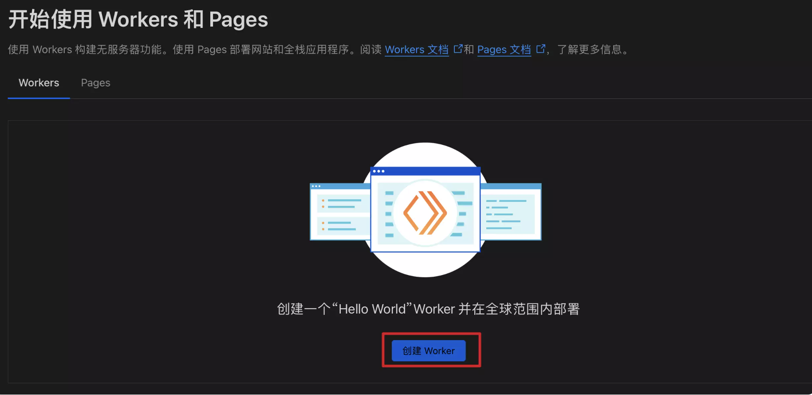
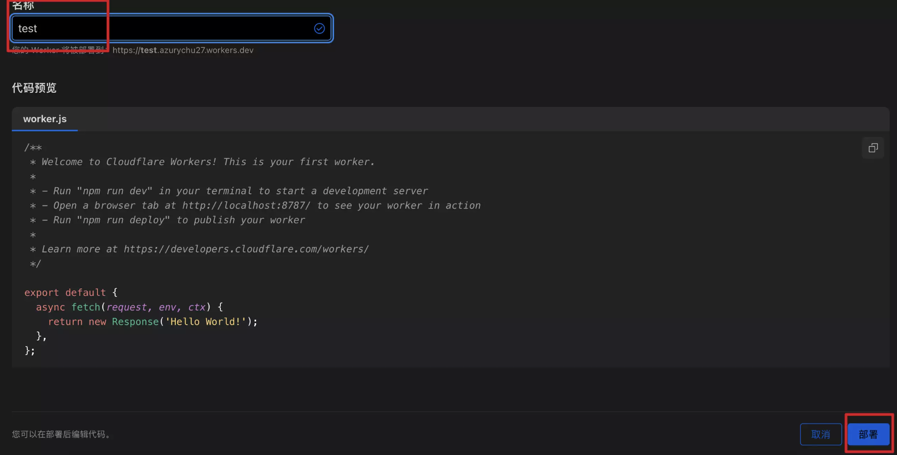
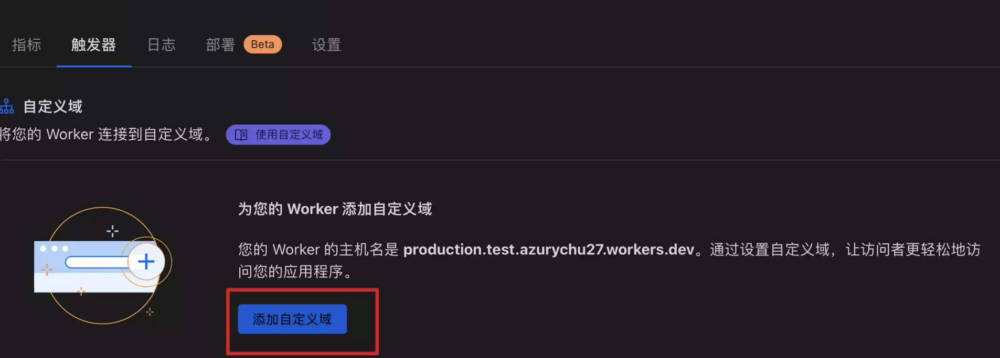
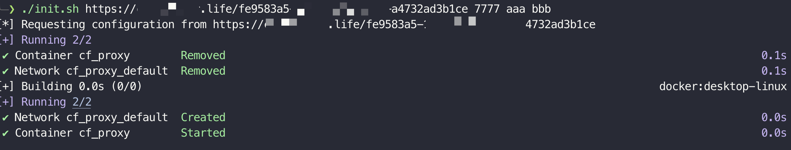
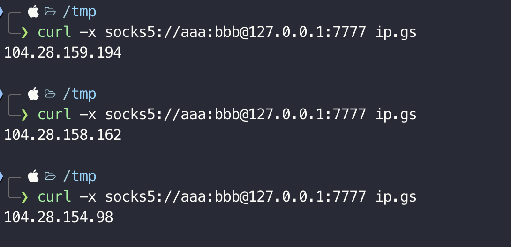

# CF workers proxy
## cloudflare workers
主要使用项目为 [edgetunnel](https://github.com/zizifn/edgetunnel)。

### 部署

1、访问 https://dash.cloudflare.com/login 注册

2、点击 workers 和 pages

3、创建 worker



4、随意创建一个名称，点击部署，然后再编辑代码



5、把 `js` 目录下的[worker.js](./js/worker.js),部署到cloudflare。

6、修改 `UUID` 和 `proxyIP`, uuid随机生成一个即可。

>proxyIP主要是为了转发请求到部署在CF上的网站使用的，可以使用以下域名

```
cdn-all.xn--b6gac.eu.org 
cdn.xn--b6gac.eu.org 
cdn-b100.xn--b6gac.eu.org 
edgetunnel.anycast.eu.org 
cdn.anycast.eu.org
```

### 添加自定义域名
如果workers.dev无法直接访问，可以添加自定义域名访问。


### 开启服务
部署完成以后，可以通过 域名+`uuid`的方式获取到配置。执行以下命令即可：
```
[+] Usage: ./init.sh <url> <port> [username] [password]
```
>url 为域名+uuid



完成后，可使用代理服务。


